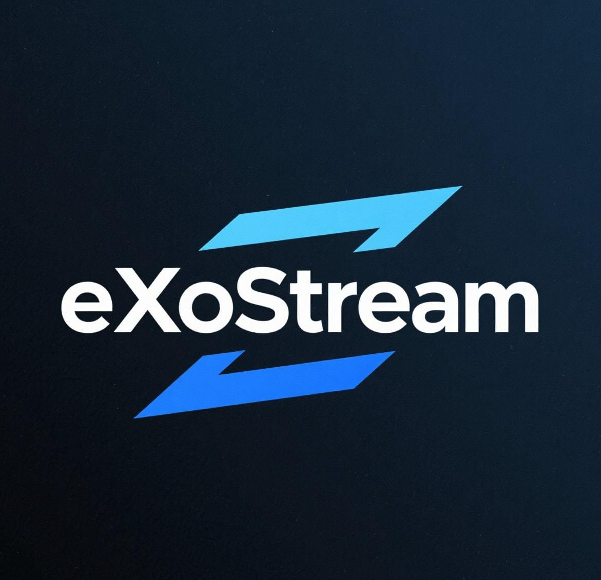

# 📦 eXoStream - Streaming Search & Download

<p align="center">
  <br>
  <b>An open-source app for downloading movies, TV shows, and anime from websites.</b>
</p>

  
## 🚀 Features

- ✅ Latest Movies/TV Shows
- ✅ Movie Downloads
- ✅ TV Show Downloads
- ✅ New Software Update Check

## 🛠️ Technologies Used

- Language: `Java >= 1.8`
- Other Tools: `Maven`
- OS: `Windows`

## 📦 Quick Start

### DNS Settings

Set your DNS to:

- **Primary:** `8.8.8.8`  
- **Secondary:** `8.8.4.4`

### Jar Creation

```bash
mvn clean package
```
After that, you can run:

```bash
java -jar <your_jar_file>
```

### Launch exe 
Simply start the .exe file. 

### Download videos
All files are downloaded into the **out** folder. Enjoy :-)

## 💝 Support the Project
If you like this project, you can support me with BTC:  

**BTC Address:** `33hy7Dm6QRgycdGFts1VhcWn2sHTjDwoQe`  

Or scan the QR code below:  


 
# Disclaimer

This software is provided "as is", without warranty of any kind, express or implied, including but not limited to the warranties of merchantability, fitness for a particular purpose, and noninfringement. In no event shall the authors or copyright holders be liable for any claim, damages, or other liability, whether in an action of contract, tort, or otherwise, arising from, out of, or in connection with the software or the use or other dealings in the software.